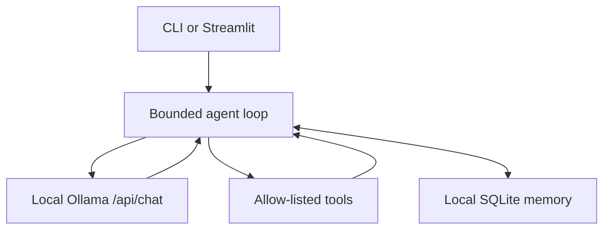

# hoodaAgents

A local-first AI agent runtime built for Ollama: native multi-step tool calling,
bounded local memory, optional live search, structured outputs, and measurable
capability evaluations.

**Ollama model:** [hoodarunner/hoodaAgents](https://ollama.com/hoodarunner/hoodaAgents)

hoodaAgents does not require an OpenAI or Anthropic key. The core agent talks
directly to Ollama's local `/api/chat` endpoint and continues through a bounded
tool loop until the model produces a final answer.

## Capabilities

- Native Ollama multi-turn and parallel tool calling
- Thinking support with traces hidden unless explicitly requested
- Schema-constrained JSON responses
- Local SQLite conversation memory with named sessions and bounded history
- Safe AST-based calculator with no `eval` or shell execution
- Timezone-aware date/time tool
- Optional Tavily web search; offline tools work without any API key
- Allow-listed tools, argument validation, output truncation, and loop limits
- CLI, Python API, and Streamlit UI
- Deterministic unit tests plus a live Ollama evaluation harness

The Modelfile now uses `qwen3.5:9b`, a tool-capable, thinking-capable,
multimodal model. The runtime remains model-configurable for smaller or larger
hardware.

## Architecture



Tool results are treated as untrusted data. Only final user and assistant
messages enter persistent memory; intermediate thinking and tool payloads do
not.

## Quick start

Requires Python 3.11+ and a running Ollama installation.

```bash
git clone https://github.com/yashhooda1/hoodaAgents.git
cd hoodaAgents

python -m venv .venv
source .venv/bin/activate
python -m pip install -r config/requirements.txt
cp .env.example .env

ollama pull qwen3.5:9b
ollama create hoodaAgents -f Modelfile
OLLAMA_MODEL=hoodaAgents python main.py
```

Run one prompt:

```bash
OLLAMA_MODEL=hoodaAgents python main.py --no-memory \
  "Use the calculator to compute sqrt(144) + 7"
```

Run the web UI:

```bash
OLLAMA_MODEL=hoodaAgents streamlit run web/app.py
```

Run the published model directly:

```bash
ollama run hoodarunner/hoodaAgents
```

## Configuration

Copy `.env.example` to `.env`. The important settings are:

| Variable | Default | Purpose |
|---|---|---|
| `OLLAMA_BASE_URL` | `http://localhost:11434` | Local Ollama server |
| `OLLAMA_MODEL` | `hoodarunner/hoodaAgents` | Model used by the runtime |
| `OLLAMA_CONTEXT_LENGTH` | `32768` | Agent context window |
| `HOODA_THINK` | `true` | Boolean or supported thinking level |
| `HOODA_MAX_STEPS` | `8` | Hard tool-loop bound |
| `HOODA_MEMORY` | `on` | Enable local SQLite memory |
| `HOODA_MEMORY_PATH` | `~/.hoodaagents/memory.db` | Local memory database |
| `TAVILY_API_KEY` | unset | Enables optional live web search |

When `TAVILY_API_KEY` is absent, `web_search` is not registered and the
agent stays fully local.

## Python API

```python
from hooda_agents import build_agent

agent = build_agent()
result = agent.run(
    "Calculate 18 * 7 and give me the current date in UTC.",
    session_id="demo",
)

print(result.text)
print([event.as_dict() for event in result.tool_events])
```

Schema-constrained output:

```python
schema = {
    "type": "object",
    "required": ["summary", "priority"],
    "properties": {
        "summary": {"type": "string"},
        "priority": {"type": "integer"},
    },
}

payload = agent.complete_json("Classify this task...", schema)
```

## Quality gates

Unit tests do not need a live model:

```bash
python -m compileall -q .
python -m unittest discover -s tests -v
```

The live evaluation harness measures real model tool selection and completion:

```bash
python evals/run_evals.py --model hoodaAgents
```

The current scenarios cover direct answers, calculator use, current-time use,
and parallel tool selection. Add scenarios before claiming new capabilities.

## Publish to Ollama

Build and evaluate locally before updating the public model:

```bash
ollama pull qwen3.5:9b
ollama create hoodaAgents -f Modelfile
python evals/run_evals.py --model hoodaAgents

ollama signin
ollama cp hoodaAgents hoodarunner/hoodaAgents
ollama push hoodarunner/hoodaAgents
```

## Security

- Never commit `.env`, credentials, or memory databases.
- Any credential ever committed to Git history must remain revoked; deleting
  the current file does not remove historical copies.
- Tools are registered explicitly. There is no shell, filesystem-write, or
  arbitrary-code tool.
- Calculator expressions are parsed through a restricted AST.
- Tool errors are returned to the model without crashing the process.
- Prompt size, history, tool output, and agent steps are bounded.

## Project structure

```text
hooda_agents/
  agent.py       bounded orchestration loop
  client.py      native Ollama HTTP client
  config.py      validated environment settings
  memory.py      local SQLite session memory
  tools.py       schemas, registry, and safe tools
  cli.py         interactive and one-shot interface
web/app.py       Streamlit interface
evals/           live capability evaluation
tests/           deterministic unit tests
Modelfile        publishable Ollama model blueprint
```

Built by [Yash Hooda](https://yashhooda.ai).
